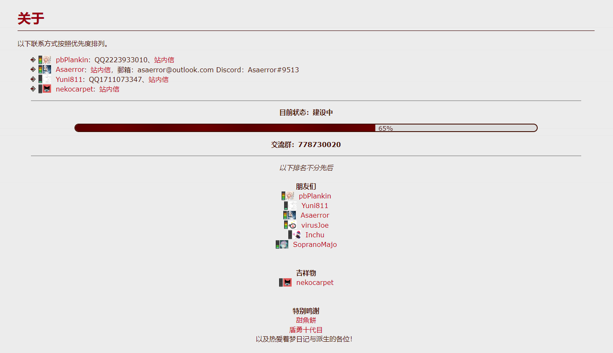

# dotflowcn-source
[.flow中文维基](http://dotflowcn.wikidot.com)[^AccessMethod]的wikidot源代码备份。`000-path,pagename.csv`是页面名和标题的对照表。`files`目录下包含.flow中文维基所有页面的附件。

源代码的作者列表可在[网站](http://dotflowcn.wikidot.com/contact)[^AccessMethod][^EmptyBox]中查看，使用CC-BY-SA 3.0协议发布，包括`pages`与`files`目录下的内容。参见`pages/LICENSE`与`files/LICENSE`。

除非另有声明，此存储库的其余内容使用CC-BY-SA 4.0协议发布。

一些wikidot系统页面和依赖wikidot模块的页面未被备份。

***

迁移至MediaWiki，需要注意的问题：
* 有2个标题为“植物”的页面。
* 2个页面，“侵蚀度”和“小铁锈子”，包含文件名相同的附件，但内容不同。

[^AccessMethod]: 如果无法进入，可使用[FoggyPath](https://github.com/rHanbowChic/FoggyPath)。
[^EmptyBox]: 这个页面当前是空白的，因为管理员pbPlankin在10月5日由于未知原因清空了它。同时被清空的还有“dotflow中文维基”，“下载”，“效果”，“地图”，“角色”，“事件”与“其他”这几个顶部导航栏可直接访问的页面。但是，在“历史记录”中仍然可以查看以前的页面版本。

*所以pbP到底遭遇了什么？*
